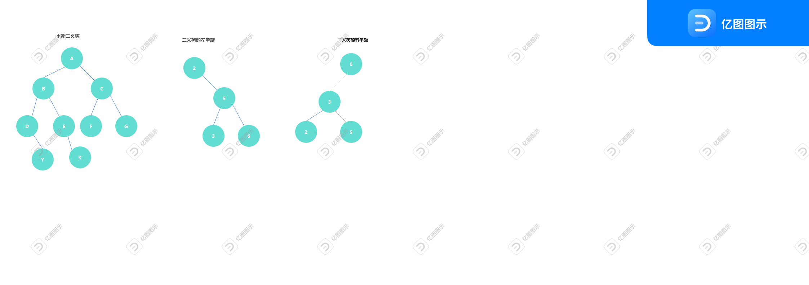

<!--
 * @Description: 有问题,联系qq:2479879758
 * @Author: zhulinhai
 * @LastEditTime: 2022-08-13 11:21:23
-->

# 树形结构

    树形结构(有向无环图)--树是图的一种；
    树形结构有根节点，树形结构没有回路。
    只有一个根节点
    节点：既不是根节点，又不是叶子节点的普通节点
    叶子节点:下边没有其他节点
    树的度：树有最多杈的节点，有多个杈，这个树的度就为多少！
    树的深度:树最深有几层，树的深度就为几。

# 二叉树

    定义: 树的度最多为2的树形结构
    满二叉树:
        所有的叶子节点都在树的最底层
        每个非叶子节点都有两个子节点
    完全二叉树:
        国内定义:
            叶子节点都在最后一层或倒数第二层
            叶子节点都向左聚拢
        国外定义:
            叶子节点都在最后一层或倒数第二层
            如果有叶子节点，就必然有两个叶子节点
    子树：
        定义：二叉树中，每一个节点或叶子节点，都是一颗子树的根节点，二叉树中每个节点都认为自己是根节点。
        左子树,右子树：相对于上一层根节点来说，左边的子树为左子树，右边的子树为右子树。
    二叉树的搜索
        树的搜索，图的搜索，爬虫的逻辑，搜索引擎的爬虫算法
        深度优先搜索：更适合探索未知
        广度优先搜索：更适合探索局域

# 二叉树常见考法

    给出二叉树，写出前序中序后序遍历
    写出前序中序后序遍历的代码
    给出前序中序还原二叉树，要求写出后序遍历
    给出后序中序还原二叉树，要求写出前序遍历

# 生成最小二叉树

## 普利姆算法(加减法)

    1.任选一个点为连接起点;
    2.找的与当前点连接的最小路径
    3.如果这个路径未被连通，那么进行连接，如果此路径已经被连通则寻找次最小路径。依次类推
    5.重复1到3直到全部路径都被连通

## 克鲁斯卡尔算法(加边法)

    1.选择最短的边进行连接
    2.要保证连接的两端至少有一个点是新的，或者是未进行连接的部落(点设为村庄，两个及以上为部落)
    3.重复1到2,直到全部的村庄(点),全部连接到一起

# 进阶搜索树

## 二叉搜索树

    首先这是一颗二叉树，其次有排序功能，并且左子树的节点比当前节点小,右子树节点都比当前节点大

## 二叉平衡搜索树

    1.根节点的左子树和右子树高度差不能超过1
    2.二叉树的每个子树都符合第一条。

### 二叉树的单旋(左单旋，右单旋)

        某一节点不平衡，如果左边浅，右边深，进行左单旋，反之进行右单旋;
        选转节点：不平衡的节点为旋转节点(2)
        新根：旋转之后称为根节点的节点(5)
        变化分支:父节点发生变化的那个分支
        不变分支：父级节点不变的那个分支;
        左单旋时:
            旋转节点：当前不平衡的节点
            新根：右子树的根节点
            变化分支：旋转节点的右子树的左子树
            不变分支：旋转节点的右子树的右子树
        右单旋:
            旋转节点：当前不平衡的节点
            新根：左子树的根节点
            变化分支：旋转节点的左子树的右子树
            不变分支：旋转节点的左子树的左子树
        
        具体如下图:

## 二叉树的双旋(左右双旋,右左双旋)

**右左双旋**:
    当对某个节点进行左单旋时，变化分支不是可以唯一的最深分支,如果变化分支是最深分支，要对新根先进行右单旋，然后再进行左单旋;

**左右单旋**:
         当对某个节点进行右单旋时，变化分支不是可以唯一的最深分支,如果变化分支是最深分支，要对新根先进行左单旋，然后再进行右单旋;
